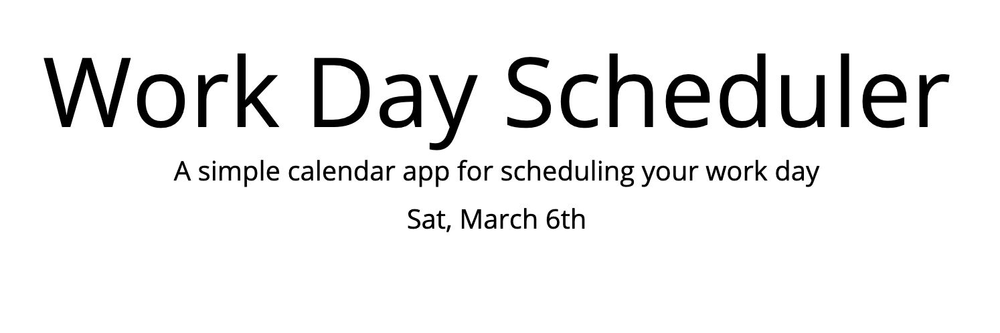
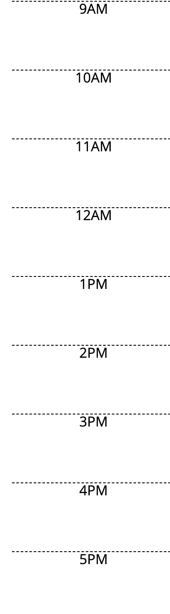
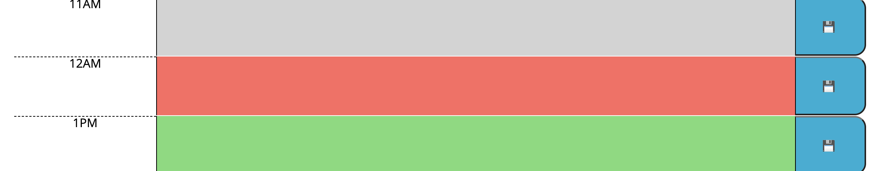
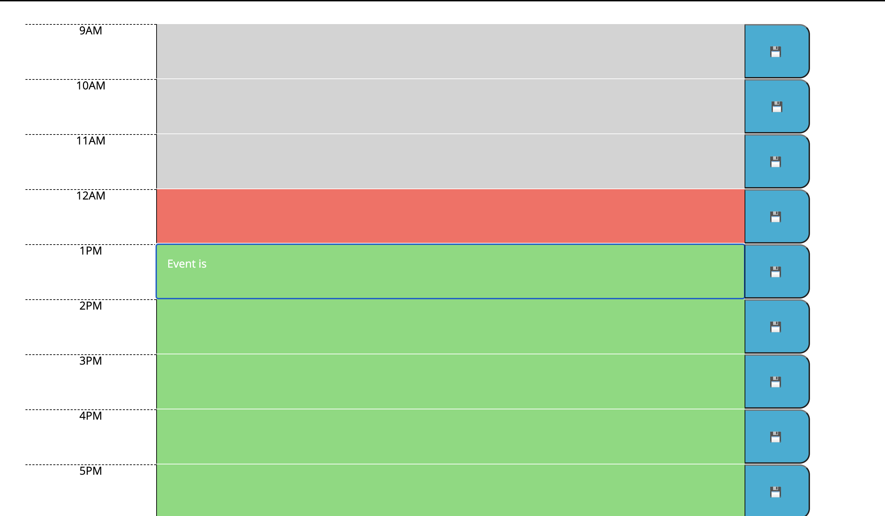
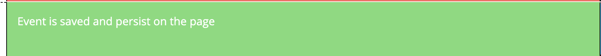

# Work Day Scheduler 

## Introduction
Work Day Scheduler is a tool for planning working day. It provides time block for each hour of a working day.

## Purpose
Enter and monitor daily events in a color interactive display. Where green colors presents future, grey presents past and red presents present moment. 

## Describtion
1. As the user opens up a page he is presented with a current day, date and a month

2. As the user scrools down he is presented with time blocks for standard business hours

3. Each time block is color-coded to indicate whether it is in the past, present, or future

4. User can click on a time block and enter an event

5. User can click on a save button and that event is saved in local storage

6. After refreshing the page saved event persist

## Build with
Side server API's like:
- Bootstrap
- jQueary
- Moment.js 

## Credits
- my tutor Dru Sanchez
- TA Artur Markov

## Copyright
Copyright (c) 2021 Yevgeniya Terlyuk
